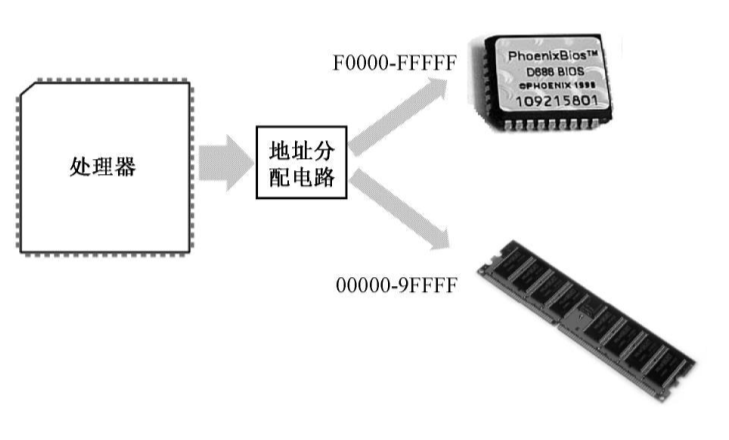

# 浅显的知识。
## 已学过的内容
进制转换、计算机组成
## 软件
使用的NASM编译器
```
nasm –f bin exam.asm –o exam.bin
```
> NASM 需要一系列参数才能正常工作。-f 参数的作用是指定输出文件的格式（Format）。这样，-f bin 就是要求NASM 生成的文件只包含“纯二进制”的内容。-o 参数指定编译后输出（Output）的文件名。

NASM的优点是允许在源程序之中只包含汇编指令。

HexView用来看十六进制代码
## 8086
在处理器众多的引脚中，有一个是RESET，用于接受复位信号。每当处理器加电，或者RESET 引脚的电平由低变高时[1]，处理器都会执行一个硬件初始化，以及一个可选的内部自测试（Build-in Self-Test，BIST），然后将内部所有寄存器的内容初始到一个预置的状态。

比如，对于Intel 8086 来说，复位将使代码段寄存器（CS）的内容为0xFFFF，其他所有寄存器的内容都为0x0000，包括指令指针寄存器（IP）。8086 之后的处理器并未延续这种设计，但毫无疑问，无论怎么设计，都是有目的的。

在以Intel 8086 为处理器的系统中，ROM 占据着整个内存空间顶端的64KB，物理地址范围是0xF0000～0xFFFFF，里面固化了开机时要执行的指令；DRAM 占据着较低端的640KB，地址范围是0x00000～0x9FFFF；中间还有一部分，分给了其他外围设备，这个以后再说。因为8086 加电或者复位时，CS=0xFFFF，IP=0x0000，所以，它取的第一条指令位于物理地址0xFFFF0，正好位于ROM 中，那里固化了开机时需要执行的指令。
处理器取指令执行的自然顺序是从内存的低地址往高低地址推进。如果从0xFFFF0 开始执行，这个位置离1MB 内存的顶端（物理地址0xFFFFF）只有16 个字节的长度，一旦IP 寄存器的值超过0x000F，比如IP=0x0011，那么，它与CS 一起形成的物理地址将因为溢出而变成0x00001，这将回绕到1MB 内存的最低端所以，ROM 中位于物理地址0xFFFF0 的地方，通常是一个跳转指令，它通过改变CS 和IP的内容，使处理器从ROM 中的较低地址处开始取指令执行。
## 磁盘
扇区、柱面、磁道等内容。主要使用逻辑扇区

主引导扇区
> 硬盘的第一个扇区是0 面0 道1 扇区，或者说是0 头0 柱1 扇区，这个扇区称为主引导扇区。如果计算机的设置是从硬盘启动，那么，ROM-BIOS 将读取硬盘主引导扇区的内容，将它加载到内存地址0x0000:0x7c00 处（也就是物理地址0x07C00），然后用一个jmp 指令跳到那里接着执行
## 虚拟机
VirtualBox、
### 虚拟硬盘
所以要采用固定尺寸的VHD 虚拟硬盘，是因为其简单性。

虚拟硬盘实际上是一个文件。固定尺寸的VHD 虚拟硬盘是一个具有“.vhd”扩展名的文件，它仅包括两个部分，前面是数据区，用来模拟实际的硬盘空间，后面跟着一个512 字节的结尾（2004 年前的规范里只有511 字节）。

> 要访问硬盘，运行中的程序必须至少向硬盘控制器提供4 个参数，分别是磁头号、磁道号、扇区号，以及访问意图（是读还是写）。

**硬盘的读写是以扇区为最小单位的。所以，无论什么时候，要从硬盘读数据，或者向硬盘写数据，至少得是1 个扇区。**

在VHD 规范里，每个扇区是512 字节。VHD 文件一开始的512 字节，就对应着物理硬盘的0 面0 道1 扇区。然后，VHD 文件的第二个512 字节，对应着0 面0 道2 扇区，后面的以此类推，一直对应到0 面0 道n 扇区。这里，n 等于每磁道的扇区数。
再往后，因为硬盘的访问是按柱面进行的，所以，在VHD 文件中，紧接着前面的数据块，下一个数据块对应的是1 面0 道1 扇区，就这样一直往后排列，当把第一个柱面全部对应完后，再从第二个柱面开始对应。

文件尾信息是以一个字符串“conectix”开始的。这个标志用来告诉试图打开它的虚拟机，这的确是一个合法的VHD 文件。该标志称为VHD 创建者标识，就是说，该公司（conectix）创建了VHD 文件格式的最初标准从这个标志开始，后面的数据包含了诸如文件的创建日期、VHD 的版本、创建该文件的应用程序名称和版本、创建该文件的应用程序所属的操作系统、该虚拟硬盘的参数（磁头数、每面磁道数、每磁道扇区数）、VHD 类型（固定尺寸还是动态增长）、虚拟硬盘容量等。
### 逻辑扇区
LBA 是逻辑扇区号，C、H、S 是想求得逻辑扇区号的那个物理扇区所在的磁道、磁头和扇区号。

$$LBA=C*磁头总数*每道扇区数+H*每道扇区数+(S-1)$$

采用LBA 模式的好处是简化了程序的操作，使得程序员不用关心数据在硬盘上的具体位置。
