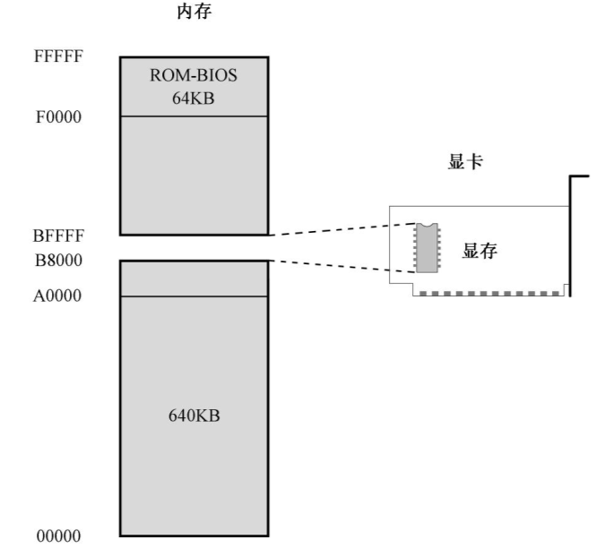

# 实模式
## 主引导扇区
处理器加电或者复位之后，如果硬盘是首选的启动设备，那么，ROM-BIOS 将试图读取硬盘的0 面0 道1 扇区。传统上，这就是主引导扇区（Main Boot Sector，MBR）。
读取的主引导扇区数据有512 字节，ROM-BIOS 程序将它加载到逻辑地址0x0000:0x7c00处，也就是物理地址0x07c00 处，然后判断它是否有效。
一个有效的主引导扇区，其最后两字节应当是0x55 和0xAA。ROM-BIOS 程序首先检测这两个标志，如果主引导扇区有效，则以一个段间转移指令jmp 0x0000:0x7c00 跳到那里继续执行。
## 显卡和显存
显卡都有自己的存储器，因为它位于显卡上，故称显示存储器（Video RAM：VRAM），简称显存，要显示的内容都预先写入显存。

显卡的工作是周期性地从显存中提取这些比特，并把它们按顺序显示在屏幕上。如果是比特“0”，则像素保持原来的状态不变，因为屏幕本来就是黑的；如果是比特“1”，则点亮对应的像素。

> 问题是，操作显存里的比特，使得屏幕上能显示出字符的形状，是非常麻烦、非常繁重的工作，因为你必须计算该字符所对应的比特位于显存里的什么位置。为了方便，工程师们想出了一个办法。就像一个二进制数既可以是一个普通的数，也可以代表一条处理器指令一样，他们认为每个字符也可以表示成一个数。比如，数字0x4C 就代表字符“L”，这个数被称为是字符“L”的ASCII 代码，后面会讲到。

传统上，这种专门用于显示字符的工作方式称为文本模式。文本模式和图形模式是显卡的两种基本工作模式，可以用指令访问显卡，设置它的显示模式。在不同的工作模式下，显卡对显存内容的解释是不同的。


086 可以访问1MB 内存。其中，0x00000～9FFFF 属于常规内存，由内存条提供；0xF0000～0xFFFFF 由主板上的一个芯片提供，即OM-BIOS。


这样一来，中间还有一个320KB 的空洞，即0xA0000～0xEFFFF。传统上，这段地址空间由特定的外围设备来提供，其中就包括显卡。因为显示功能对于现代计算机来说实在是太重要了。
由于历史的原因，所有在个人计算机上使用的显卡，在加电自检之后都会把自己初始化到80× 25 的文本模式。在这种模式下，屏幕上可以显示25 行，每行80 个字符，每屏总共2000 个字符。
所以，如上图所示，一直以来，0xB8000～0xBFFFF 这段物理地址空间，是留给显卡的，由显卡来提供，用来显示文本。除非显卡出了毛病，否则这段空间总是可以访问的。如果显卡出了毛病怎么办呢？很简单，计算机一定不会通过加电自检过程，这就是传说中的严重错误，计算机是无法启动的，更不要说加载并执行主引导扇区的内容了。

屏幕上的每个字符对应着显存中的两个连续字节，前一个是字符的ASCII 代码，后面是字符的显示属性，包括字符颜色（前景色）和底色（背景色）。
## 其他
注释必须以英文字母“;”开始。
ASCII 码
## 汇编
``` asm
mov byte [es:0x00],'L'
;等效于
mov byte [es:0x00],0x4c
```
## Bochs调试器
模拟硬件的虚拟机，使用命令类似于gdb